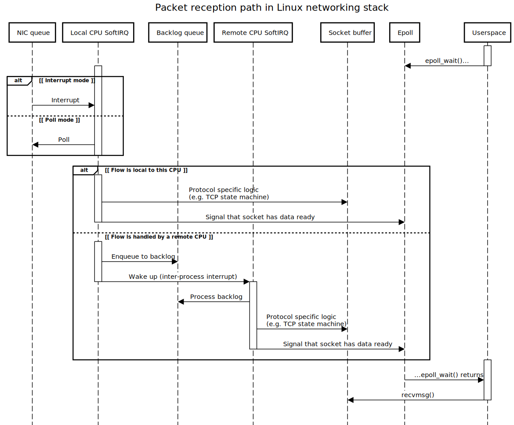

# Notes on Linux Network Internals

## Kernel Data Structures

### Network Devices

Network devices are represented with the `struct net_device` data structure in the Linux kernel. The following table shows network device operations. It does not, however, define operations for _receiving_ data. The device driver uses the `request_irq` and `netif_napi_add` functions to register device driver functions for handling interrupts and polling, respectively.

#### Network Device Operations (`struct net_device_ops`)

| Operation | Description |
| --------- | ----------- |
| `ndo_open` | The network device is transitioning to the up state. |
| `ndo_close` | The network device is transitioning to the down state. |
| `ndo_start_xmit` | Start transmission at hardware level. |
| `ndo_select_queue` | Select transmission queue to use (if device supports multiple TX queues). |

### Socket Buffers

Socket buffer (SKB), represented by `struct sk_buff`, represents packet data flowing in the system. SKBs are allocated when device driver notices new data has arrived on the NIC and when userspace application passes data to be transmitted via a system call such as `send`. SKBs traverse through different Linux networking stack layers and between CPU cores.

## Reception

When a packet arrives on the NIC RX queue, the device driver either receives an interrupt or notices the new packet via polling. The device driver then allocates a SKB for the packet and passes the SKB to the networking stack. If the device driver received an interrupt, it calls `netif_rx` function to pass the packet and if the driver used polling, it calls the `netif_receive_skb` function. The `netif_rx` function calls the `netif_rx_internal` function, which either calls the `__netif_receive_skb` if RPS is disabled. If RPS is enabled, the `netif_rx_internal` function calculates the CPU that is responsible for the packet using a flow hash (i.e. 4-tuple of source/destination addresses and source/destination ports). The `netif_rx_internal` funcion then calls the `enqueue_to_backlog` function, which places the SKB on a per-CPU backlog queue and wakes up the per-process `RX_NET` softirq.

The `RX_NET` softirq's main function is `net_rx_action` and it is responsible for processing the per-CPU backlog queue. The `net_rx_action` function has a time limit for processing the backlog in the softirq context, which is configured via the `/proc/sys/net/core/netdev_budget_usecs` system configuration option. The default time limit for `net_rx_action` is 2 ms. The `net_rx_action` function processes the backlog queue by calling `napi_poll`, which calls the `process_backlog` function via `struct napi_struct`'s `poll` member. The `process_backlog` removes SKBs from the backlog queue and calls `__netif_receive_skb`, similar to the non-RPS case.

The `__netif_receive_skb` function calls the `__netif_receive_skb_core` function, which looks up a per-packet type handler to further process the SKB. For example, for IPv4 TCP packets, the `__netif_receive_skb_core` function calls the `ip_rcv` function, which eventually calls `tcp_v4_rcv` function. If the TCP connection is in established state, the `tcp_v4_rcv` function calls the `tcp_rcv_established` function, which, after performing more TCP/IP state machine logic, calls the `sk_data_ready` function of the SKB. The `sk_data_ready` function points to the `sock_def_readable` function, which calls `wake_up_interruptible_sync_poll` to wake up the process that is waiting in `ep_wait`. The `ep_wait` then delivers epoll events and returns to userspace, which can then call `recv` system call, for example, to obtain new data that was packed in socket buffer.

If the device driver noticed a new packet via interrupts and passed SKB to the networking stack via `netif_rx` function or if `netif_rx_internal` placed the SKB on a remote CPU backlog queue, no network stack processing is performed until the `RX_NET` softirq for that CPU was run. This means that if a thread is placed on a different CPU than the CPU that received NIC interrupt or performed polling, `epoll_wait` will always block because the softirq on that CPU needs to run first. That is, even if new SKBs are already placed on the backlog queue, they are not available to userspace until `RX_NET` softirq has been run and the userspace thread is woken up again. The `ep_poll` function optimizes this case if `CONFIG_NET_RX_BUSY_POLL` kernel config option is enabled. The `ep_poll` function calls `ep_busy_loop` if there are no available events before blocking. The `ep_busy_loop` calls `napi_busy_loop`, which then uses `napi_poll` to process local CPU backlog queue with `process_backlog`. The `ep_busy_loop` keeps going until new events arrive or it reaches a poll timeout configured by `/proc/sys/net/core/busy_poll` system configuration option. One possible optimization for Linux would be to change `ep_poll` to always run `ep_busy_loop` for one iteration to benefit from polling but reduce excessive CPU usage of busy-polling.

## Transmission

When the userspace thread has performed its own processing logic on the received message, it constructs a response, and passes it to the kernel using the `sendto` system call, for example. The `sendto` system call checks that the buffer passed to it is accessible and calls `sock_sendmsg`. The `sock_sendmsg` function then calls the `sendmsg` operation of `struct proto` of the socket, which is a protocol specific function.  For example, for IPv4 TCP sockets, the `sock_sendmsg` calls the `tcp_sendmsg` function. The `tcp_sendmsg` function calls internal function `tcp_sendmsg_locked`, which appends the message to socket's `sk_write_queue`, allocating a new SKB if needed. The `tcp_sendmsg_locked` then calls `tcp_push` to flush out full TCP segments with `__tcp_push_pending_frames` that calls `tcp_write_xmit`. The `tcp_write_xmit` function calls `tcp_transmit_skb`, which calls `ip_queue_xmit` via the `queue_xmit` operation of `struct inet_connection_sock`. The `ip_queue_xmit` function calls `ip_local_out`, which calls an internal function `__ip_local_out` that finally calls `dst_output` that points to `ip_finish_output`. The `ip_finish_output` function calls `ip_finish_output2`, which then calls `neigh_output` that calls `neigh_hh_output`. The `neigh_hh_output`calls `dev_queue_xmit`, which calls internal function `__dev_queue_xmit` that calls `__dev_xmit_skb`, which queues a SKB to qdisc.  The `__netif_reschedule` function places a qdisc on `output_queue`. The `TX_NET` softirq's main function is `net_tx_action`, which processes `output_queue` and `completion_queue` of `struct softnet_data`. The `net_tx_action` calls `qdisc_run` for qdiscs on `output_queue`, which calls `__qdisc_run`. The `__qdisc_run` function calls `qdisc_restart` function, which calls `sch_direct_xmit`, which calls `dev_hard_start_xmit`. The `dev_hard_start_xmit` calls `xmit_one` that calls `netdev_start_xmit` that calls device driver specific operation `ndo_start_transmit`, which is responsible for placing packets to NIC TX queues.
